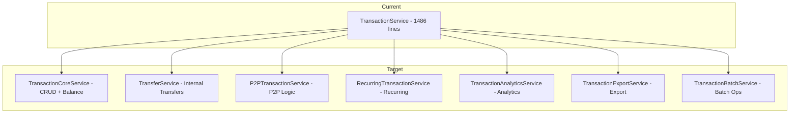

# DigiTransac Architecture Improvements - Implementation Plan

This document outlines the comprehensive plan to improve the DigiTransac application architecture.

## Overview

| Phase | Improvement | Estimated Effort | Priority |
|-------|-------------|------------------|----------|
| 1 | Split TransactionService | 3-4 days | High |
| 2 | Unit of Work Pattern | 2-3 days | High |
| 3 | Result Pattern | 2 days | Medium |
| 4 | Domain Events | 3-4 days | Medium |
| 5 | Frontend Improvements | 2 days | Medium |
| 6 | API Versioning | 1 day | Medium |
| 7 | Caching Strategy | 1-2 days | Low |
| 8 | Test Coverage | 3-4 days | Medium |

**Total Estimated Effort: 17-24 days**

---

## Phase 1: Split TransactionService into Focused Services

### Current State
The `TransactionService.cs` is 1,486 lines handling multiple responsibilities:
- CRUD operations
- Transfer logic
- P2P transactions
- Recurring transactions
- Analytics
- Export
- Batch operations

### Target Architecture



### New Service Structure

#### 1.1 TransactionCoreService
**Responsibility:** Basic CRUD operations and balance management

```csharp
public interface ITransactionCoreService
{
    Task<TransactionResponse?> GetByIdAsync(string id, string userId);
    Task<TransactionListResponse> GetAllAsync(string userId, TransactionFilterRequest filter);
    Task<(bool Success, string Message, TransactionResponse? Transaction)> CreateAsync(
        string userId, CreateTransactionRequest request);
    Task<(bool Success, string Message, TransactionResponse? Transaction)> UpdateAsync(
        string id, string userId, UpdateTransactionRequest request);
    Task<(bool Success, string Message)> DeleteAsync(string id, string userId);
    Task UpdateAccountBalanceAsync(Account account, TransactionType type, decimal amount, bool isAdding);
}
```

**File:** `api/Services/TransactionCoreService.cs`

#### 1.2 TransferService
**Responsibility:** Internal account-to-account transfers

```csharp
public interface ITransferService
{
    Task<(bool Success, string Message, TransactionResponse? Transaction)> CreateTransferAsync(
        string userId, CreateTransactionRequest request, Account sourceAccount, Account destinationAccount);
    Task<(bool Success, string Message)> UpdateLinkedTransactionAsync(
        Transaction transaction, UpdateTransactionRequest request);
    Task<(bool Success, string Message)> DeleteTransferAsync(
        string userId, Transaction transaction);
}
```

**File:** `api/Services/TransferService.cs`

#### 1.3 P2PTransactionService
**Responsibility:** Peer-to-peer transaction logic

```csharp
public interface IP2PTransactionService
{
    Task<(bool Success, string Message, TransactionResponse? Transaction)> CreateP2PTransactionAsync(
        string userId, CreateTransactionRequest request, User counterparty);
    Task SyncP2PTransactionAsync(Transaction transaction, UpdateTransactionRequest request);
    Task<(bool Success, string Message)> DeleteP2PTransactionAsync(
        string userId, Transaction transaction);
    Task<List<CounterpartyInfo>> GetCounterpartiesAsync(string userId);
}
```

**File:** `api/Services/P2PTransactionService.cs`

#### 1.4 RecurringTransactionService
**Responsibility:** Recurring transaction templates and processing

```csharp
public interface IRecurringTransactionService
{
    Task<List<RecurringTransactionResponse>> GetRecurringAsync(string userId);
    Task<(bool Success, string Message, TransactionResponse? Transaction)> CreateRecurringTemplateAsync(
        string userId, CreateTransactionRequest request, Account account);
    Task<(bool Success, string Message)> DeleteRecurringAsync(
        string id, string userId, bool deleteFutureInstances);
    Task ProcessRecurringTransactionsAsync();
    DateTime CalculateNextOccurrence(RecurringRule rule);
}
```

**File:** `api/Services/RecurringTransactionService.cs`

#### 1.5 TransactionAnalyticsService
**Responsibility:** Analytics and summary calculations

```csharp
public interface ITransactionAnalyticsService
{
    Task<TransactionSummaryResponse> GetSummaryAsync(string userId, TransactionFilterRequest filter);
    Task<TransactionAnalyticsResponse> GetAnalyticsAsync(
        string userId, DateTime? startDate, DateTime? endDate, string? accountId);
}
```

**File:** `api/Services/TransactionAnalyticsService.cs`

#### 1.6 TransactionExportService
**Responsibility:** Export functionality

```csharp
public interface ITransactionExportService
{
    Task<List<TransactionResponse>> GetAllForExportAsync(
        string userId, TransactionFilterRequest filter);
    Task<string> ExportToCsvAsync(string userId, TransactionFilterRequest filter);
    Task<byte[]> ExportToExcelAsync(string userId, TransactionFilterRequest filter);
}
```

**File:** `api/Services/TransactionExportService.cs`

#### 1.7 TransactionBatchService
**Responsibility:** Batch operations

```csharp
public interface ITransactionBatchService
{
    Task<BatchOperationResponse> BatchDeleteAsync(string userId, List<string> ids);
    Task<BatchOperationResponse> BatchUpdateStatusAsync(
        string userId, List<string> ids, string status);
}
```

**File:** `api/Services/TransactionBatchService.cs`

### Implementation Steps

1. **Create base interfaces and shared utilities**
   - Create `api/Services/Transactions/` directory
   - Move shared helper methods to `TransactionMapperService`
   
2. **Extract TransactionCoreService**
   - Move CRUD operations
   - Move balance update logic
   - Keep as the primary service that orchestrates others

3. **Extract TransferService**
   - Move transfer creation logic
   - Move linked transaction sync logic

4. **Extract P2PTransactionService**
   - Move P2P creation logic
   - Move P2P sync logic

5. **Extract RecurringTransactionService**
   - Move recurring template logic
   - Move background processing logic

6. **Extract TransactionAnalyticsService**
   - Move summary calculations
   - Move analytics calculations

7. **Extract TransactionExportService**
   - Move export logic

8. **Extract TransactionBatchService**
   - Move batch operations

9. **Update DI registration in Program.cs**

10. **Update endpoints to use new services**

11. **Update tests**

---

## Phase 2: Implement Unit of Work Pattern

### Current Problem
Multiple repository calls without transaction guarantees:

```csharp
// Current: No atomicity
await _transactionRepository.CreateAsync(transaction);
await _accountRepository.UpdateAsync(account);  // What if this fails?
await _transactionRepository.CreateAsync(linkedTransaction);  // Orphaned data!
```

### Solution: MongoDB Session-based Unit of Work

#### 2.1 IUnitOfWork Interface

```csharp
// api/Services/IUnitOfWork.cs
public interface IUnitOfWork : IDisposable
{
    IClientSessionHandle Session { get; }
    Task BeginTransactionAsync(CancellationToken cancellationToken = default);
    Task CommitAsync(CancellationToken cancellationToken = default);
    Task RollbackAsync(CancellationToken cancellationToken = default);
    Task<T> ExecuteInTransactionAsync<T>(
        Func<IClientSessionHandle, Task<T>> action,
        CancellationToken cancellationToken = default);
}
```

#### 2.2 UnitOfWork Implementation

```csharp
// api/Services/UnitOfWork.cs
public class UnitOfWork : IUnitOfWork
{
    private readonly IMongoClient _client;
    private IClientSessionHandle? _session;
    private bool _disposed;

    public UnitOfWork(IMongoDbService mongoDbService)
    {
        _client = mongoDbService.Client;
    }

    public IClientSessionHandle Session => 
        _session ?? throw new InvalidOperationException("Transaction not started");

    public async Task BeginTransactionAsync(CancellationToken cancellationToken = default)
    {
        _session = await _client.StartSessionAsync(cancellationToken: cancellationToken);
        _session.StartTransaction();
    }

    public async Task CommitAsync(CancellationToken cancellationToken = default)
    {
        if (_session == null) return;
        await _session.CommitTransactionAsync(cancellationToken);
    }

    public async Task RollbackAsync(CancellationToken cancellationToken = default)
    {
        if (_session == null) return;
        await _session.AbortTransactionAsync(cancellationToken);
    }

    public async Task<T> ExecuteInTransactionAsync<T>(
        Func<IClientSessionHandle, Task<T>> action,
        CancellationToken cancellationToken = default)
    {
        using var session = await _client.StartSessionAsync(cancellationToken: cancellationToken);
        
        return await session.WithTransactionAsync(
            async (s, ct) => await action(s),
            cancellationToken: cancellationToken);
    }

    public void Dispose()
    {
        if (_disposed) return;
        _session?.Dispose();
        _disposed = true;
    }
}
```

#### 2.3 Update Repository Interface

```csharp
public interface ITransactionRepository
{
    // Add session parameter overloads
    Task<Transaction> CreateAsync(Transaction transaction, IClientSessionHandle? session = null);
    Task UpdateAsync(Transaction transaction, IClientSessionHandle? session = null);
    Task<bool> DeleteAsync(string id, string userId, IClientSessionHandle? session = null);
}
```

#### 2.4 Update Repository Implementation

```csharp
public async Task<Transaction> CreateAsync(Transaction transaction, IClientSessionHandle? session = null)
{
    if (session != null)
        await _transactions.InsertOneAsync(session, transaction);
    else
        await _transactions.InsertOneAsync(transaction);
    
    return transaction;
}
```

#### 2.5 Usage in Service

```csharp
public async Task<(bool, string, TransactionResponse?)> CreateTransferAsync(...)
{
    return await _unitOfWork.ExecuteInTransactionAsync(async session =>
    {
        // All operations use the same session
        var transaction = await _transactionRepository.CreateAsync(sourceTransaction, session);
        await _accountRepository.UpdateAsync(sourceAccount, session);
        
        var linkedTransaction = await _transactionRepository.CreateAsync(destTransaction, session);
        await _accountRepository.UpdateAsync(destAccount, session);
        
        return (true, "Success", MapToResponse(transaction));
    });
}
```

### Implementation Steps

1. Update `IMongoDbService` to expose `IMongoClient`
2. Create `IUnitOfWork` interface
3. Create `UnitOfWork` implementation
4. Add session parameters to all repository methods
5. Update services to use UnitOfWork for multi-document operations
6. Register UnitOfWork in DI (Scoped lifetime)
7. Add tests for transaction rollback scenarios

---

## Phase 3: Implement Result Pattern

### Current Problem
Inconsistent error handling with tuples:

```csharp
// Current: Tuple-based returns
Task<(bool Success, string Message, TransactionResponse? Transaction)> CreateAsync(...)

// Problems:
// 1. No type safety for error types
// 2. Can't distinguish NotFound from ValidationError
// 3. Verbose and repetitive
```

### Solution: Result<T> Pattern

#### 3.1 Core Result Types

```csharp
// api/Common/Result.cs
public abstract record Error(string Code, string Message);

public record ValidationError(string Code, string Message, Dictionary<string, string[]>? Details = null) 
    : Error(Code, Message);

public record NotFoundError(string Code, string Message) : Error(Code, Message);

public record ConflictError(string Code, string Message) : Error(Code, Message);

public record UnauthorizedError(string Code, string Message) : Error(Code, Message);

public record InternalError(string Code, string Message, Exception? Exception = null) 
    : Error(Code, Message);

public class Result<T>
{
    public bool IsSuccess { get; }
    public bool IsFailure => !IsSuccess;
    public T? Value { get; }
    public Error? Error { get; }

    private Result(T value)
    {
        IsSuccess = true;
        Value = value;
        Error = null;
    }

    private Result(Error error)
    {
        IsSuccess = false;
        Value = default;
        Error = error;
    }

    public static Result<T> Success(T value) => new(value);
    public static Result<T> Failure(Error error) => new(error);

    public static implicit operator Result<T>(T value) => Success(value);
    public static implicit operator Result<T>(Error error) => Failure(error);

    public TResult Match<TResult>(
        Func<T, TResult> onSuccess,
        Func<Error, TResult> onFailure)
    {
        return IsSuccess ? onSuccess(Value!) : onFailure(Error!);
    }
}

public class Result
{
    public bool IsSuccess { get; }
    public bool IsFailure => !IsSuccess;
    public Error? Error { get; }

    private Result() { IsSuccess = true; }
    private Result(Error error) { IsSuccess = false; Error = error; }

    public static Result Success() => new();
    public static Result Failure(Error error) => new(error);
    public static implicit operator Result(Error error) => Failure(error);
}
```

#### 3.2 Common Errors

```csharp
// api/Common/Errors.cs
public static class Errors
{
    public static class Transaction
    {
        public static NotFoundError NotFound(string id) => 
            new("TRANSACTION_NOT_FOUND", $"Transaction {id} not found");
        
        public static ValidationError InvalidAmount() => 
            new("INVALID_AMOUNT", "Amount must be positive");
        
        public static ValidationError SplitMismatch(decimal splitSum, decimal amount) =>
            new("SPLIT_MISMATCH", $"Split amounts ({splitSum}) must equal transaction amount ({amount})");
    }

    public static class Account
    {
        public static NotFoundError NotFound(string id) =>
            new("ACCOUNT_NOT_FOUND", $"Account {id} not found");
        
        public static ConflictError Archived() =>
            new("ACCOUNT_ARCHIVED", "Cannot use an archived account");
    }

    public static class Auth
    {
        public static UnauthorizedError InvalidCredentials() =>
            new("INVALID_CREDENTIALS", "Invalid email or password");
        
        public static UnauthorizedError TokenExpired() =>
            new("TOKEN_EXPIRED", "Your session has expired");
    }
}
```

#### 3.3 Update Service Interface

```csharp
// Before:
Task<(bool Success, string Message, TransactionResponse? Transaction)> CreateAsync(
    string userId, CreateTransactionRequest request);

// After:
Task<Result<TransactionResponse>> CreateAsync(
    string userId, CreateTransactionRequest request);
```

#### 3.4 Update Service Implementation

```csharp
public async Task<Result<TransactionResponse>> CreateAsync(
    string userId, CreateTransactionRequest request)
{
    var account = await _accountRepository.GetByIdAndUserIdAsync(request.AccountId, userId);
    if (account == null)
        return Errors.Account.NotFound(request.AccountId);

    if (request.Amount <= 0)
        return Errors.Transaction.InvalidAmount();

    // ... rest of logic

    return response; // Implicit conversion to Result<T>
}
```

#### 3.5 Endpoint Result Handling Extension

```csharp
// api/Extensions/ResultExtensions.cs
public static class ResultExtensions
{
    public static IResult ToHttpResult<T>(this Result<T> result)
    {
        if (result.IsSuccess)
            return Results.Ok(result.Value);

        return result.Error switch
        {
            NotFoundError e => Results.NotFound(new { message = e.Message }),
            ValidationError e => Results.BadRequest(new { message = e.Message, details = e.Details }),
            ConflictError e => Results.Conflict(new { message = e.Message }),
            UnauthorizedError e => Results.Unauthorized(),
            InternalError e => Results.Problem(e.Message),
            _ => Results.BadRequest(new { message = result.Error?.Message })
        };
    }

    public static IResult ToCreatedResult<T>(this Result<T> result, string uri)
    {
        if (result.IsSuccess)
            return Results.Created(uri, result.Value);
        return result.ToHttpResult();
    }
}
```

#### 3.6 Updated Endpoint

```csharp
group.MapPost("/", async (
    CreateTransactionRequest request,
    ClaimsPrincipal user,
    ITransactionCoreService transactionService) =>
{
    var userId = user.FindFirst(ClaimTypes.NameIdentifier)?.Value;
    if (string.IsNullOrEmpty(userId))
        return Results.Unauthorized();

    var result = await transactionService.CreateAsync(userId, request);
    return result.ToCreatedResult($"/api/transactions/{result.Value?.Id}");
});
```

### Implementation Steps

1. Create `api/Common/` directory
2. Create `Result.cs` with Result<T> and Result types
3. Create `Errors.cs` with domain-specific errors
4. Create `ResultExtensions.cs` for HTTP conversion
5. Update service interfaces to use Result<T>
6. Update service implementations
7. Update endpoints to use ToHttpResult()
8. Update tests to assert on Result types

---

## Phase 4: Add Domain Events

### Current Problem
Tight coupling in services:

```csharp
// CreateAsync does too many things:
await _transactionRepository.CreateAsync(transaction);
await UpdateAccountBalanceAsync(...);  // Side effect
await _chatMessageRepository.CreateAsync(chatMessage);  // Side effect
```

### Solution: MediatR-based Domain Events

#### 4.1 Install MediatR

```xml
<PackageReference Include="MediatR" Version="12.2.0" />
```

#### 4.2 Domain Events

```csharp
// api/Events/TransactionEvents.cs
public record TransactionCreatedEvent(
    Transaction Transaction, 
    string UserId,
    Account Account) : INotification;

public record TransactionUpdatedEvent(
    Transaction Transaction,
    Transaction OldTransaction,
    string UserId) : INotification;

public record TransactionDeletedEvent(
    Transaction Transaction,
    string UserId,
    Account? Account) : INotification;

public record TransferCreatedEvent(
    Transaction SourceTransaction,
    Transaction DestinationTransaction,
    string UserId) : INotification;

public record P2PTransactionCreatedEvent(
    Transaction SenderTransaction,
    Transaction? ReceiverTransaction,
    User Counterparty) : INotification;
```

#### 4.3 Event Handlers

```csharp
// api/Events/Handlers/UpdateBalanceHandler.cs
public class UpdateBalanceHandler : 
    INotificationHandler<TransactionCreatedEvent>,
    INotificationHandler<TransactionDeletedEvent>
{
    private readonly IAccountRepository _accountRepository;
    
    public async Task Handle(TransactionCreatedEvent notification, CancellationToken ct)
    {
        await UpdateBalance(
            notification.Account, 
            notification.Transaction.Type, 
            notification.Transaction.Amount, 
            isAdding: true);
    }

    public async Task Handle(TransactionDeletedEvent notification, CancellationToken ct)
    {
        if (notification.Account == null) return;
        
        await UpdateBalance(
            notification.Account,
            notification.Transaction.Type,
            notification.Transaction.Amount,
            isAdding: false);
    }

    private async Task UpdateBalance(Account account, TransactionType type, decimal amount, bool isAdding)
    {
        var change = type switch
        {
            TransactionType.Receive => amount,
            TransactionType.Send => -amount,
            _ => 0m
        };

        if (!isAdding) change = -change;
        account.CurrentBalance += change;
        await _accountRepository.UpdateAsync(account);
    }
}
```

```csharp
// api/Events/Handlers/CreateChatMessageHandler.cs
public class CreateChatMessageHandler : INotificationHandler<TransactionCreatedEvent>
{
    private readonly IChatMessageRepository _chatMessageRepository;
    private readonly ITransactionRepository _transactionRepository;

    public async Task Handle(TransactionCreatedEvent notification, CancellationToken ct)
    {
        var transaction = notification.Transaction;
        if (transaction.IsRecurringTemplate) return;

        var recipientUserId = !string.IsNullOrEmpty(transaction.CounterpartyUserId)
            ? transaction.CounterpartyUserId
            : notification.UserId;

        var chatMessage = new ChatMessage
        {
            SenderUserId = notification.UserId,
            RecipientUserId = recipientUserId,
            Type = ChatMessageType.Transaction,
            TransactionId = transaction.Id,
            Status = MessageStatus.Sent,
            CreatedAt = DateTime.UtcNow
        };

        await _chatMessageRepository.CreateAsync(chatMessage);
        
        transaction.ChatMessageId = chatMessage.Id;
        await _transactionRepository.UpdateAsync(transaction);
    }
}
```

#### 4.4 Updated Service Using Events

```csharp
public class TransactionCoreService : ITransactionCoreService
{
    private readonly IMediator _mediator;
    
    public async Task<Result<TransactionResponse>> CreateAsync(
        string userId, CreateTransactionRequest request)
    {
        // ... validation and creation logic ...
        
        await _transactionRepository.CreateAsync(transaction);
        
        // Publish event instead of calling other services directly
        await _mediator.Publish(new TransactionCreatedEvent(transaction, userId, account));
        
        return MapToResponse(transaction);
    }
}
```

#### 4.5 Register MediatR in DI

```csharp
// Program.cs
builder.Services.AddMediatR(cfg => 
    cfg.RegisterServicesFromAssembly(typeof(Program).Assembly));
```

### Implementation Steps

1. Install MediatR NuGet package
2. Create `api/Events/` directory
3. Define domain events
4. Create event handlers
5. Register MediatR in DI
6. Update services to publish events instead of direct calls
7. Add logging to event handlers
8. Add tests for event handlers

---

## Phase 5: Frontend Improvements

### 5.1 Global Error Handling

```typescript
// web/src/lib/queryClient.ts
import { QueryClient, MutationCache, QueryCache } from '@tanstack/react-query';
import { toast } from 'your-toast-library'; // or custom implementation

export const queryClient = new QueryClient({
  queryCache: new QueryCache({
    onError: (error, query) => {
      // Only show error toast for queries that don't have their own error handling
      if (query.meta?.showErrorToast !== false) {
        console.error('Query error:', error);
      }
    },
  }),
  mutationCache: new MutationCache({
    onError: (error, _variables, _context, mutation) => {
      // Skip if mutation has its own onError handler
      if (mutation.options.onError) return;
      
      const message = error instanceof Error 
        ? error.message 
        : 'An unexpected error occurred';
      
      toast.error(message);
    },
    onSuccess: (_data, _variables, _context, mutation) => {
      // Skip if mutation has its own onSuccess handler with toast
      if (mutation.options.meta?.skipSuccessToast) return;
      
      const successMessage = mutation.options.meta?.successMessage;
      if (successMessage) {
        toast.success(successMessage as string);
      }
    },
  }),
  defaultOptions: {
    queries: {
      staleTime: 2 * 60 * 1000, // 2 minutes
      retry: (failureCount, error) => {
        // Don't retry on 4xx errors
        if (error instanceof Error && error.message.includes('401')) return false;
        if (error instanceof Error && error.message.includes('403')) return false;
        if (error instanceof Error && error.message.includes('404')) return false;
        return failureCount < 3;
      },
    },
    mutations: {
      retry: false,
    },
  },
});
```

### 5.2 Toast Provider

```typescript
// web/src/components/ToastProvider.tsx
import { createContext, useContext, useState, useCallback, ReactNode } from 'react';

interface Toast {
  id: string;
  type: 'success' | 'error' | 'info' | 'warning';
  message: string;
}

interface ToastContextType {
  toasts: Toast[];
  addToast: (type: Toast['type'], message: string) => void;
  removeToast: (id: string) => void;
}

const ToastContext = createContext<ToastContextType | undefined>(undefined);

export function ToastProvider({ children }: { children: ReactNode }) {
  const [toasts, setToasts] = useState<Toast[]>([]);

  const addToast = useCallback((type: Toast['type'], message: string) => {
    const id = crypto.randomUUID();
    setToasts(prev => [...prev, { id, type, message }]);
    
    // Auto-remove after 5 seconds
    setTimeout(() => {
      setToasts(prev => prev.filter(t => t.id !== id));
    }, 5000);
  }, []);

  const removeToast = useCallback((id: string) => {
    setToasts(prev => prev.filter(t => t.id !== id));
  }, []);

  return (
    <ToastContext.Provider value={{ toasts, addToast, removeToast }}>
      {children}
      <ToastContainer toasts={toasts} onRemove={removeToast} />
    </ToastContext.Provider>
  );
}

export function useToast() {
  const context = useContext(ToastContext);
  if (!context) throw new Error('useToast must be used within ToastProvider');
  return context;
}

// Global toast function for use outside React
export const toast = {
  success: (message: string) => window.dispatchEvent(
    new CustomEvent('toast', { detail: { type: 'success', message } })
  ),
  error: (message: string) => window.dispatchEvent(
    new CustomEvent('toast', { detail: { type: 'error', message } })
  ),
  info: (message: string) => window.dispatchEvent(
    new CustomEvent('toast', { detail: { type: 'info', message } })
  ),
  warning: (message: string) => window.dispatchEvent(
    new CustomEvent('toast', { detail: { type: 'warning', message } })
  ),
};
```

### 5.3 Optimistic Updates Enhancement

```typescript
// web/src/hooks/useTransactionQueries.ts
export function useDeleteTransaction() {
  const queryClient = useQueryClient();
  
  return useMutation({
    mutationFn: (id: string) => deleteTransaction(id),
    onMutate: async (id: string) => {
      // Cancel any outgoing refetches
      await queryClient.cancelQueries({ queryKey: queryKeys.transactions.all });
      
      // Snapshot current state
      const previousTransactions = queryClient.getQueriesData<TransactionListResponse>({
        queryKey: queryKeys.transactions.all
      });
      
      // Optimistically remove from all caches
      queryClient.setQueriesData<TransactionListResponse>(
        { queryKey: queryKeys.transactions.all },
        (old) => old ? {
          ...old,
          transactions: old.transactions.filter(t => t.id !== id),
          totalCount: old.totalCount - 1
        } : old
      );
      
      return { previousTransactions };
    },
    onError: (_err, _id, context) => {
      // Rollback on error
      context?.previousTransactions?.forEach(([queryKey, data]) => {
        queryClient.setQueryData(queryKey, data);
      });
    },
    onSettled: () => {
      queryClient.invalidateQueries({ queryKey: queryKeys.transactions.all });
      queryClient.invalidateQueries({ queryKey: queryKeys.accounts.all });
    },
    meta: {
      successMessage: 'Transaction deleted',
    },
  });
}
```

### 5.4 Error Boundary Improvements

```typescript
// web/src/components/ErrorBoundary.tsx
import { Component, ReactNode } from 'react';
import { captureException } from '../services/sentry';

interface Props {
  children: ReactNode;
  name: string;
  fallback?: ReactNode;
}

interface State {
  hasError: boolean;
  error?: Error;
}

export class ErrorBoundary extends Component<Props, State> {
  state: State = { hasError: false };

  static getDerivedStateFromError(error: Error): State {
    return { hasError: true, error };
  }

  componentDidCatch(error: Error, errorInfo: React.ErrorInfo) {
    captureException(error, {
      componentName: this.props.name,
      componentStack: errorInfo.componentStack,
    });
  }

  render() {
    if (this.state.hasError) {
      return this.props.fallback || (
        <div className="p-4 bg-red-50 dark:bg-red-900/20 rounded-lg">
          <h2 className="text-lg font-semibold text-red-800 dark:text-red-200">
            Something went wrong
          </h2>
          <p className="text-red-600 dark:text-red-300 mt-1">
            {this.state.error?.message || 'An unexpected error occurred'}
          </p>
          <button
            onClick={() => this.setState({ hasError: false, error: undefined })}
            className="mt-3 px-4 py-2 bg-red-100 dark:bg-red-800 rounded hover:bg-red-200 dark:hover:bg-red-700"
          >
            Try again
          </button>
        </div>
      );
    }

    return this.props.children;
  }
}
```

### Implementation Steps

1. Create ToastProvider component
2. Update queryClient with global error handling
3. Add ToastProvider to App.tsx
4. Update mutation hooks with optimistic updates
5. Improve ErrorBoundary component
6. Add loading states and skeleton components

---

## Phase 6: API Versioning

### 6.1 Install Package

```xml
<PackageReference Include="Asp.Versioning.Http" Version="8.0.0" />
```

### 6.2 Configure API Versioning

```csharp
// Program.cs
builder.Services.AddApiVersioning(options =>
{
    options.DefaultApiVersion = new ApiVersion(1, 0);
    options.AssumeDefaultVersionWhenUnspecified = true;
    options.ReportApiVersions = true;
    options.ApiVersionReader = ApiVersionReader.Combine(
        new UrlSegmentApiVersionReader(),
        new HeaderApiVersionReader("X-Api-Version")
    );
}).AddApiExplorer(options =>
{
    options.GroupNameFormat = "'v'VVV";
    options.SubstituteApiVersionInUrl = true;
});
```

### 6.3 Update Endpoints

```csharp
// api/Endpoints/TransactionEndpoints.cs
public static void MapTransactionEndpoints(this IEndpointRouteBuilder app)
{
    var versionSet = app.NewApiVersionSet()
        .HasApiVersion(new ApiVersion(1, 0))
        .ReportApiVersions()
        .Build();

    var group = app.MapGroup("/api/v{version:apiVersion}/transactions")
        .WithApiVersionSet(versionSet)
        .WithTags("Transactions")
        .RequireAuthorization();

    // ... endpoints
}
```

### 6.4 Backward Compatibility Route

```csharp
// For backward compatibility, also map to /api/transactions
var legacyGroup = app.MapGroup("/api/transactions")
    .WithTags("Transactions (Legacy)")
    .RequireAuthorization();

// Map same endpoints to legacy group
```

### Implementation Steps

1. Install Asp.Versioning.Http package
2. Configure API versioning in Program.cs
3. Update all endpoint groups with version sets
4. Add legacy route mappings for backward compatibility
5. Update Swagger configuration
6. Update frontend API_BASE_URL or add version to requests

---

## Phase 7: Improve Caching Strategy

### 7.1 DEK Cache with Eviction

```csharp
// api/Services/DekCacheService.cs
public interface IDekCacheService
{
    byte[]? GetDek(string userId);
    void SetDek(string userId, byte[] dek);
    void RemoveDek(string userId);
    void RemoveAll();
}

public class DekCacheService : IDekCacheService
{
    private readonly IMemoryCache _cache;
    private readonly ILogger<DekCacheService> _logger;
    private static readonly TimeSpan SlidingExpiration = TimeSpan.FromMinutes(30);
    private static readonly TimeSpan AbsoluteExpiration = TimeSpan.FromHours(4);

    public DekCacheService(IMemoryCache cache, ILogger<DekCacheService> logger)
    {
        _cache = cache;
        _logger = logger;
    }

    public byte[]? GetDek(string userId)
    {
        var key = GetCacheKey(userId);
        if (_cache.TryGetValue(key, out byte[]? dek))
        {
            _logger.LogDebug("DEK cache hit for user {UserId}", userId);
            return dek;
        }
        _logger.LogDebug("DEK cache miss for user {UserId}", userId);
        return null;
    }

    public void SetDek(string userId, byte[] dek)
    {
        var key = GetCacheKey(userId);
        var options = new MemoryCacheEntryOptions
        {
            SlidingExpiration = SlidingExpiration,
            AbsoluteExpirationRelativeToNow = AbsoluteExpiration,
            Size = 1, // Count-based size
            Priority = CacheItemPriority.High
        };
        
        options.RegisterPostEvictionCallback((key, value, reason, state) =>
        {
            _logger.LogDebug("DEK evicted for key {Key}, reason: {Reason}", key, reason);
        });

        _cache.Set(key, dek, options);
        _logger.LogDebug("DEK cached for user {UserId}", userId);
    }

    public void RemoveDek(string userId)
    {
        var key = GetCacheKey(userId);
        _cache.Remove(key);
        _logger.LogInformation("DEK removed from cache for user {UserId}", userId);
    }

    public void RemoveAll()
    {
        // IMemoryCache doesn't support clearing all, but we can use a prefix scan
        // For production, consider using IDistributedCache with Redis
        _logger.LogWarning("RemoveAll called but IMemoryCache doesn't support bulk removal");
    }

    private static string GetCacheKey(string userId) => $"dek:{userId}";
}
```

### 7.2 Evict DEK on Logout

```csharp
// In AuthService.cs
public async Task<bool> RevokeTokenAsync(string refreshToken)
{
    var storedToken = await _refreshTokenRepository.GetByTokenAsync(refreshToken);
    if (storedToken == null || !storedToken.IsActive)
        return false;

    storedToken.RevokedAt = DateTime.UtcNow;
    await _refreshTokenRepository.UpdateAsync(storedToken);
    
    // Evict DEK from cache on logout
    _dekCacheService.RemoveDek(storedToken.UserId);
    
    _logger.LogInformation("Refresh token revoked for UserId: {UserId}", storedToken.UserId);
    return true;
}
```

### 7.3 Distributed Cache for Multi-Instance

For production with multiple instances, consider using Redis:

```csharp
// Program.cs
builder.Services.AddStackExchangeRedisCache(options =>
{
    options.Configuration = builder.Configuration.GetConnectionString("Redis");
    options.InstanceName = "DigiTransac:";
});

// Update DekCacheService to use IDistributedCache
public class DistributedDekCacheService : IDekCacheService
{
    private readonly IDistributedCache _cache;
    
    public async Task<byte[]?> GetDekAsync(string userId)
    {
        return await _cache.GetAsync($"dek:{userId}");
    }
    
    public async Task SetDekAsync(string userId, byte[] dek)
    {
        var options = new DistributedCacheEntryOptions
        {
            SlidingExpiration = TimeSpan.FromMinutes(30),
            AbsoluteExpirationRelativeToNow = TimeSpan.FromHours(4)
        };
        await _cache.SetAsync($"dek:{userId}", dek, options);
    }
}
```

### Implementation Steps

1. Update DekCacheService with sliding/absolute expiration
2. Add eviction on logout
3. Add eviction callback logging
4. Consider distributed cache for production
5. Add cache metrics/monitoring

---

## Phase 8: Add Comprehensive Test Coverage

### 8.1 Missing Test Scenarios

```csharp
// tests/Services/P2PTransactionTests.cs
public class P2PTransactionTests
{
    [Fact]
    public async Task CreateP2P_ShouldCreateLinkedPendingTransactionForCounterparty()
    
    [Fact]
    public async Task UpdateP2P_WhenCounterpartyPending_ShouldSyncChanges()
    
    [Fact]
    public async Task UpdateP2P_WhenCounterpartyConfirmed_ShouldNotSync()
    
    [Fact]
    public async Task DeleteP2P_WhenCounterpartyPending_ShouldDeleteBoth()
    
    [Fact]
    public async Task DeleteP2P_WhenCounterpartyConfirmed_ShouldOnlyDeleteOwn()
}
```

```csharp
// tests/Services/TransferTests.cs
public class TransferTests
{
    [Fact]
    public async Task CreateTransfer_WithSameCurrency_ShouldUseSameAmount()
    
    [Fact]
    public async Task CreateTransfer_WithDifferentCurrencies_ShouldConvertAmount()
    
    [Fact]
    public async Task UpdateTransfer_ShouldSyncLinkedTransaction()
    
    [Fact]
    public async Task DeleteTransfer_ShouldDeleteBothTransactions()
    
    [Fact]
    public async Task DeleteTransfer_ShouldReverseBalanceOnBothAccounts()
}
```

```csharp
// tests/Services/RecurringTransactionTests.cs
public class RecurringTransactionTests
{
    [Theory]
    [InlineData(RecurrenceFrequency.Daily, 1, 1)]
    [InlineData(RecurrenceFrequency.Weekly, 1, 7)]
    [InlineData(RecurrenceFrequency.Monthly, 1, 30)]
    [InlineData(RecurrenceFrequency.Monthly, 2, 60)]
    public async Task CalculateNextOccurrence_ShouldReturnCorrectDate(
        RecurrenceFrequency frequency, int interval, int expectedDays)
    
    [Fact]
    public async Task ProcessRecurring_WhenEndDatePassed_ShouldNotCreateNew()
    
    [Fact]
    public async Task ProcessRecurring_WithTransfer_ShouldCreateLinkedTransactions()
}
```

```csharp
// tests/Services/UnitOfWorkTests.cs
public class UnitOfWorkTests
{
    [Fact]
    public async Task ExecuteInTransaction_WhenSuccessful_ShouldCommit()
    
    [Fact]
    public async Task ExecuteInTransaction_WhenException_ShouldRollback()
    
    [Fact]
    public async Task ExecuteInTransaction_WhenPartialFailure_ShouldRollbackAll()
}
```

### 8.2 Integration Tests

```csharp
// tests/Integration/TransactionFlowTests.cs
public class TransactionFlowTests : IClassFixture<DigiTransacWebApplicationFactory>
{
    [Fact]
    public async Task CompleteTransactionFlow_CreateUpdateDelete_ShouldWork()
    
    [Fact]
    public async Task TransferFlow_ShouldUpdateBothAccountBalances()
    
    [Fact]
    public async Task P2PFlow_ShouldCreatePendingForCounterparty()
}
```

### 8.3 Frontend Tests

```typescript
// web/src/hooks/useTransactionQueries.test.ts
describe('useTransactionQueries', () => {
  describe('useDeleteTransaction', () => {
    it('should optimistically remove transaction from cache')
    it('should rollback on error')
    it('should invalidate queries on success')
  });

  describe('useCreateTransaction', () => {
    it('should invalidate transaction and account queries on success')
    it('should handle validation errors')
  });
});
```

### Implementation Steps

1. Add P2P transaction test cases
2. Add transfer test cases
3. Add recurring transaction test cases
4. Add UnitOfWork tests
5. Add integration test flows
6. Add frontend hook tests
7. Aim for 80%+ code coverage on critical paths

---

## Implementation Order

### Week 1
- [ ] Phase 1: Split TransactionService (Days 1-4)
- [ ] Phase 6: API Versioning (Day 5)

### Week 2
- [ ] Phase 2: Unit of Work Pattern (Days 1-3)
- [ ] Phase 3: Result Pattern (Days 4-5)

### Week 3
- [ ] Phase 4: Domain Events (Days 1-4)
- [ ] Phase 7: Caching Strategy (Day 5)

### Week 4
- [ ] Phase 5: Frontend Improvements (Days 1-2)
- [ ] Phase 8: Test Coverage (Days 3-5)

---

## Risk Mitigation

1. **Breaking Changes**: Maintain backward compatibility during migration
2. **Performance**: Monitor query performance after service split
3. **Testing**: Run full test suite after each phase
4. **Rollback Plan**: Use feature flags for gradual rollout

---

## Success Metrics

- [ ] TransactionService reduced to <300 lines
- [ ] All multi-document operations use Unit of Work
- [ ] 100% of service methods return Result<T>
- [ ] Event handlers have <50ms p99 latency
- [ ] Zero unhandled mutation errors in frontend
- [ ] API versioning supports v1 and legacy routes
- [ ] DEK cache eviction on logout works correctly
- [ ] Test coverage >80% on critical paths